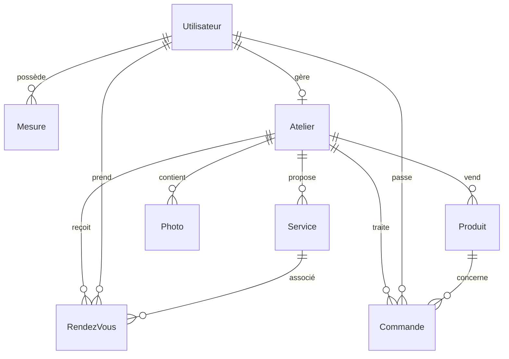

# Atelier de Couture - Système de Gestion

## Description
Système de gestion complet pour un atelier de couture, développé avec Django. Cette application permet de gérer les commandes, les rendez-vous, les mesures des clients et l'administration de l'atelier.

## Fonctionnalités Principales
- Gestion des commandes et des rendez-vous
- Suivi des mesures des clients
- Administration complète de l'atelier
- Interface utilisateur moderne avec Jazzmin
- Gestion des produits et des photos
- Système d'authentification sécurisé

## Prérequis
- Python 3.x
- MySQL
- pip (gestionnaire de paquets Python)

## Installation

1. Cloner le repository
```bash
git clone [URL_DU_REPO]
cd atelier-couture
```

2. Créer un environnement virtuel
```bash
python -m venv venv
source venv/bin/activate  # Sur Windows: venv\Scripts\activate
```

3. Installer les dépendances
```bash
pip install -r requirements.txt
```

4. Configurer la base de données MySQL
- Créer une base de données nommée `couture_db`
- Configurer les identifiants dans `settings.py`

5. Effectuer les migrations
```bash
python manage.py makemigrations
python manage.py migrate
```

6. Créer un superutilisateur
```bash
python manage.py createsuperuser
```

7. Lancer le serveur
```bash
python manage.py runserver
```

## Structure du Projet
```
atelier-couture/
├── web/
│   ├── couture/          # Configuration principale
│   ├── acceil/           # Application d'accueil
│   ├── administration/   # Gestion administrative
│   ├── atelier/         # Gestion de l'atelier
│   ├── commande/        # Gestion des commandes
│   └── utilisateur/     # Gestion des utilisateurs
├── static/              # Fichiers statiques
├── media/              # Fichiers médias
└── templates/          # Templates HTML
```

## Configuration
Le projet utilise les paramètres suivants :
- Base de données : MySQL
- Interface d'administration : Jazzmin
- Langue : Français
- Fuseau horaire : UTC

## Fonctionnalités Détaillées

### Administration
- Interface d'administration personnalisée avec Jazzmin
- Gestion des utilisateurs et des permissions
- Tableaux de bord et statistiques
- Gestion des produits et des photos

### Gestion des Commandes
- Suivi des commandes
- Gestion des rendez-vous
- Enregistrement des mesures
- Historique des transactions

### Interface Utilisateur
- Design responsive
- Thème personnalisé
- Navigation intuitive
- Support multilingue

## Sécurité
- Authentification sécurisée
- Protection CSRF
- Gestion des sessions
- Validation des données

## Contribution
Pour contribuer au projet :
1. Fork le repository
2. Créer une branche pour votre fonctionnalité
3. Commiter vos changements
4. Pousser vers la branche
5. Créer une Pull Request

## Licence
[À définir]

## Contact
[Informations de contact à ajouter]

## Structure Détaillée des Applications

### 1. Application Acceil
Application principale gérant l'accueil et l'authentification.

#### Modèles :
- **Utilisateur**
  - Champs : nom, prénom, email, téléphone, photo, rôle (gérant/client)
  - Relations : OneToOne avec Atelier (pour les gérants)

- **Atelier**
  - Champs : nom_atelier, adresse, ville, description, photo_atelier
  - Relations : OneToOne avec Utilisateur (gérant)

### 2. Application Utilisateur
Gestion des profils utilisateurs et des mesures.

#### Modèles :
- **Mesure**
  - Champs : tour_poitrine, tour_taille, tour_hanches, longueur_epaule, etc.
  - Relations : ForeignKey vers Utilisateur

### 3. Application Atelier
Gestion des services et produits de l'atelier.

#### Modèles :
- **Service**
  - Champs : nom, description, prix_minimum
  - Relations : ForeignKey vers Atelier

- **Produit**
  - Champs : nom, description, catégorie, prix, photo
  - Relations : ForeignKey vers Atelier

- **RendezVous**
  - Champs : date, heure, message, status
  - Relations : 
    - ForeignKey vers Atelier
    - ForeignKey vers Utilisateur (client)
    - ForeignKey vers Service

- **Photo**
  - Champs : image, titre, date_ajout
  - Relations : ForeignKey vers Atelier

### 4. Application Commande
Gestion des commandes clients.

#### Modèles :
- **Commande**
  - Champs : référence, date_creation, date_echeance, status
  - Relations :
    - ForeignKey vers Utilisateur (client)
    - ForeignKey vers Atelier
    - ForeignKey vers Produit

## Structure de la Base de Données

### Relations Principales


### Description des Relations
1. **Utilisateur - Atelier**
   - Relation OneToOne
   - Un utilisateur (gérant) peut gérer un seul atelier
   - Un atelier appartient à un seul gérant

2. **Utilisateur - Mesure**
   - Relation OneToMany
   - Un utilisateur peut avoir plusieurs mesures
   - Chaque mesure appartient à un seul utilisateur

3. **Atelier - Service/Produit/Photo**
   - Relations OneToMany
   - Un atelier peut avoir plusieurs services, produits et photos
   - Chaque service/produit/photo appartient à un seul atelier

4. **RendezVous**
   - Relations ManyToOne avec Atelier, Utilisateur et Service
   - Un rendez-vous est associé à un atelier, un client et un service

5. **Commande**
   - Relations ManyToOne avec Atelier, Utilisateur et Produit
   - Une commande est associée à un atelier, un client et un produit 